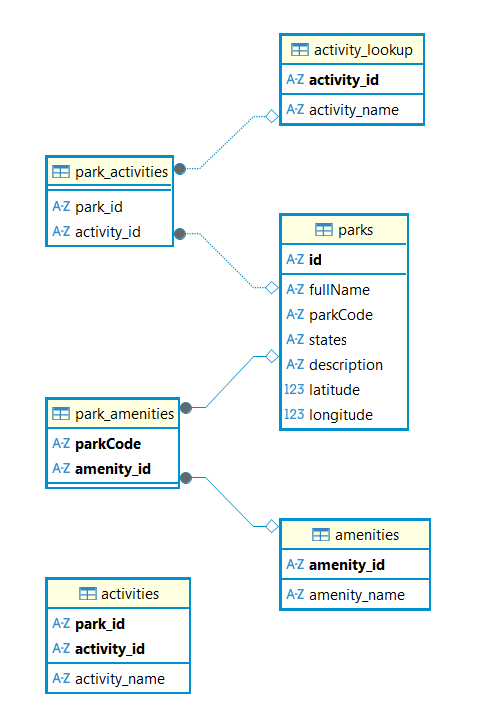

# National Parks Data Dashboard

Intro to Data Engineering (MLDS 400) - Final Project

This project pulls data from the U.S. National Park Service API, stores it in a local SQLite database, and visualizes it through an interactive R Shiny dashboard. Python handles the data ingestion and database creation, and R powers the maps, filters, and park profiles.

The dashboard also includes an optional AI summary tool. If you provide a DeepSeek API key, the app can generate short, readable descriptions for each park. If not, everything still works normally without the AI feature.

The goal is to turn a large, messy API dataset into something you can browse and understand easily, with a clean pipeline that refreshes the data in one step and a dashboard that makes the parks feel more accessible.

## Live Dashboard

You can try the full dashboard here:

https://nationalparksguide.shinyapps.io/national-parks/

This app lets you explore National Park Service data through an interactive map, filters, and summary panels. The map updates as you switch states or search for specific activities and amenities. Each marker represents a park, and clicking one opens its details.

If you’ve set an OpenRouter API key, the dashboard also generates a short AI summary describing the overall character of the parks in the selected state. The two charts on the bottom highlight the most common activities and amenities, giving you a quick sense of what each region offers.

Below is an example view of the dashboard:


If you want to set it up locally on your system, you can follow the setup process below.

## Getting the API Keys

This project uses two APIs. Only the National Park Service key is required. The DeepSeek key is optional and only needed if you want to turn on the AI generated park summaries inside the dashboard.

### National Park Service API (required)

To fetch the parks and amenities data, you’ll need an API key from the U.S. National Park Service. You can request one here:

https://www.nps.gov/subjects/developer/get-started.htm

The signup form is short. Once you submit it, the site gives you an API key right away. Add it to your environment before running the Python script:

```bash
export NPS_API_KEY="your_api_key_here"
```

### OpenRouter API (optional)

If you want the dashboard to generate AI summaries for each park, you’ll need an OpenRouter API key. You can get one here:

https://openrouter.ai/

After creating your key, add it to your environment:

```bash
export OPENROUTER_API_KEY="your_openrouter_key_here"
```
If this key isn’t set, the dashboard still runs normally, just without the AI summary feature.

## Data Ingestion (Python)

The pipeline starts with a single Python script that pulls the latest park and amenity data from the National Park Service API and loads everything into a SQLite database. This keeps the dashboard fast and removes the need for repeated API calls.

Run the script after setting your environment variables:

```bash
python read_api.py
```

When you run it, it does four things:

1. Calls the NPS Parks and Amenities endpoints  
2. Saves the raw JSON responses in the `data/` folder  
3. Logs each fetch in the `logs/` folder  
4. Builds or updates the `parks.db` database and fills all tables with fresh data  

If everything completes successfully, a new parks.db file will appear in the project root. This database powers the Shiny dashboard.

## Data Ingestion with Docker

A Dockerfile is included to automate building the `parks.db` database.
When run, the container installs dependencies, calls the NPS API through `src/read_api.py`, and writes the generated SQLite database into the `data/` folder.

Build the image:

```bash
docker build -t nationalparks-db .
```

Run the ingestion process:

```bash
docker run --rm \
  -e NPS_API_KEY="your_api_key_here" \
  -v $(pwd)/data:/app/data \
  nationalparks-db
```

## Database Structure

All of the park data is stored in a local SQLite database called `parks.db`. The schema is small and easy to work with. Parks, activities, and amenities each get their own table, and two linking tables handle the many to many relationships.

The tables are:

- **parks**: basic park info such as name, code, states, coordinates, and description  
- **activities**: activities available at each park  
- **amenities**: amenity types provided across parks  
- **park_activities**: links parks to their activities  
- **park_amenities**: links parks to their amenities  

 The ER diagram for the database is present below:

 

## R Shiny Dashboard

The dashboard reads directly from the `parks.db` database and lets you explore parks through interactive maps, filters, and park profile panels. It uses standard R packages like Shiny, Leaflet, dplyr, DBI, and RSQLite.

To launch the dashboard, open the R Markdown file in RStudio and run:

```r
rmarkdown::run("national_parks_dashboard.Rmd")
```

This command runs the entire .Rmd as a Shiny document, which means the file loads once at the start and then behaves like a live Shiny app.

## Requirements

To run the project locally, you’ll need:

**Python**
- requests
- sqlite3 (built in)
  
**R**
- shiny
- leaflet
- dplyr
- DBI
- RSQLite
- tidygeocoder
- ggplot2
- jsonlite

The exact packages are already listed in the `.Rmd`, so installing them once in RStudio is enough.

## Repository Structure

    data/                          # JSON snapshots from the NPS API
    logs/                          # Timestamped logs from each API fetch
    images/                        # Dashboard screenshots and ER diagram
    parks.db                       # SQLite database created by the Python script
    read_api.py                    # Python ingestion script
    national_parks_dashboard.Rmd   # R Shiny dashboard
    README.md


## Future Improvements

A few things that could be added next:
- A “compare states” mode to view parks across multiple states at once  
- Filters for park types (National Park, Historic Site, Monument, etc)  
- More visual layers on the map (terrain, satellite, clustering)  
- A panel showing the most visited parks once NPS releases that dataset

## Data Sources

Park and amenity data comes from the U.S. National Park Service Developer API.  
All summaries generated inside the dashboard come from the OpenRouter API when an API key is provided.


